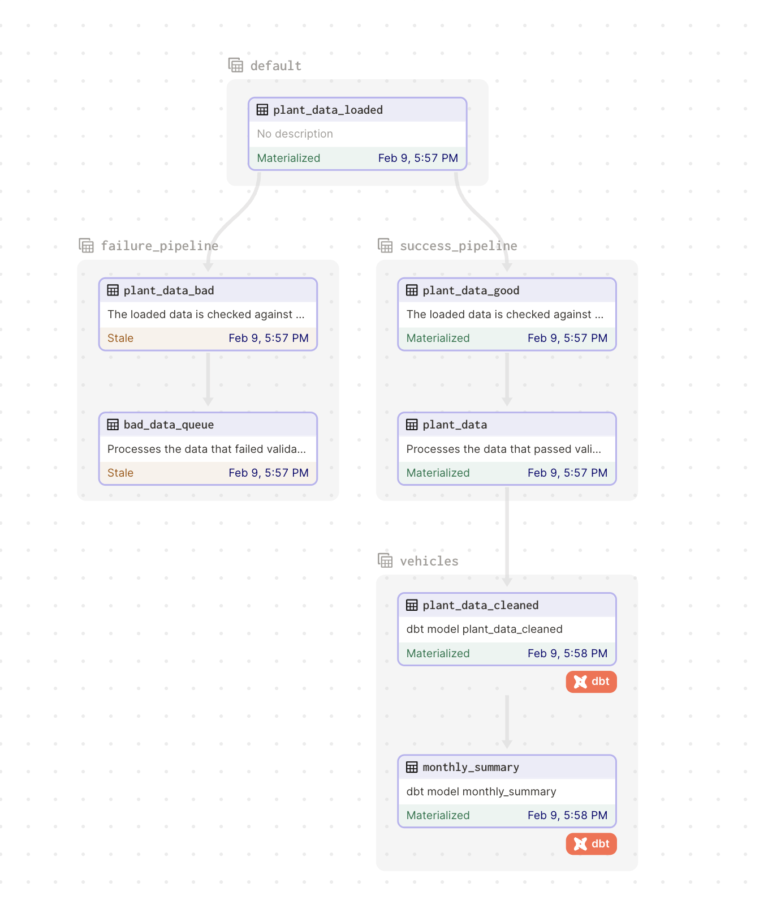

This project is an example of using Dagster to conditionally write new data to a table if that data matches a set of expectations. The project showcases a number of benefits to using Dagster including: 

- Event driven processing: eliminates the need for complex cron schedules and minimizes processing and latency
- Declarative assets: reduces the amount of code written to represent the pipeline 
- Data tests: ensures data meets quality expectations and alerts on failures
- Pluggable resources: allows for rapid local testing and confident production deployments without code re-writes


## Get started

To install the dependencies and run Dagster:

```bash
# necessary for the dbt profile to load
export GCP_BQ_DATASET="none"
export GCP_BQ_PROJECT="none"

pip install -e ".[dev]"
dagster dev
```

Once running, open the Dagster user interface. Navigate to "Overview > Sensors" and then turn on the sensor `watch_for_new_plant_data` by clicking the sensor toggle. Then click on `watch_for_new_plant_data` to view the sensor output. 

You will see the sensor launch two runs, one for the file `data/2023-01-20.csv` and one run for `data/2023-01-21.csv`.

The run for `data/2023-01-20.csv` will parse the data and pass the data checks. As a result, the data will be written to a warehouse and then downstream dbt assets will run to transform the data and create a summary table.

The run for `data/2023-01-23.csv` will fail the data checks. As a result, the data will be written to a failure location and a warning will be logged. In production the failed run could trigger an email alert.



## Use resources

By default this project uses local resources. Files are read from disk and data is loaded, transformed, and summarized using a DuckDB warehouse. This project can also run using Google Cloud, in which case files are read from a Cloud Storage bucket and data is loaded, transformed, and summarized using BigQuery. 

To use Google Cloud: 

- [ ] Create a Cloud Storage bucket, and upload the CSVs from `data` into the bucket. Add a folder in the bucket called `failed`
- [ ] Create a BigQuery dataset
- [ ] Follow the insructions in *Setup GCP Auth*
- [ ] Edit `definitions.py` to supply the appropriate configuration to the resources in `definitions.py`
- [ ] Set the environment variables `GCP_BQ_PROJECT` and `GCP_BQ_DATASET` which are used by dbt in `dbt_project/config/profiles.yaml`

- [ ] Set the environment variable `export USE_GCP="True"`

> Dev Note: This project uses pydantic for resource configuration, a capability introduced in Dagster 1.1


### Setup GCP Auth

In order to use Google Cloud you will need to setup authentication. The following steps store credentials in an encoded environment variable. The project then decodes these credenetials and sets them so that GCP clients work automatically. This approach enables you to deploy the code to Dagster Cloud and use an Environment Variable for credential management. 

1. Create a service account in GCP with permissions to read/write to a storage bucket and read/write to a BigQuery dataset. Download the JSON credential file for this service account.

2. Encode the contents of the credential file to a environment variable by running the following in a bash terminal:

```bash
export GCP_CREDS_JSON_CREDS_BASE64="$(cat $GOOGLE_AUTH_CREDENTIALS | base64)"
```

3. [Optional] Set this environment variable in Dagster Cloud

4. The project decodes this environment so that GCP clients work automatically using this code in `definitions.py`: 

```python
AUTH_FILE = "./gcp_creds.json"
with open(AUTH_FILE, "w") as f:
    json.dump(json.loads(base64.b64decode(os.getenv("GCP_CREDS_JSON_CREDS_BASE64"))), f)

os.environ["GOOGLE_APPLICATION_CREDENTIALS"] = AUTH_FILE
```

**If you run this project locally with GCP resources enabled, your credentials will be written to `.gcp_creds.json`. This project includes `*creds.json` in `.gitignore` to avoid commiting these credentials to version cotnrol.** 
